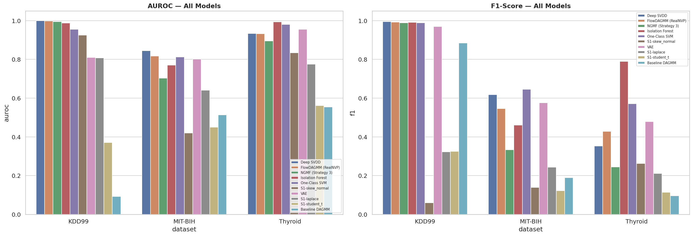
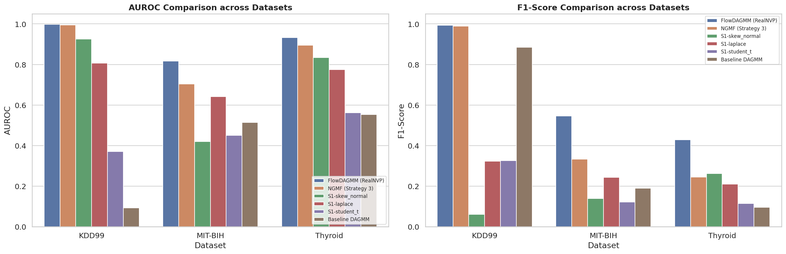
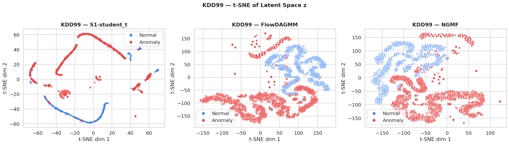
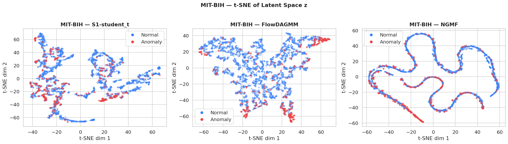
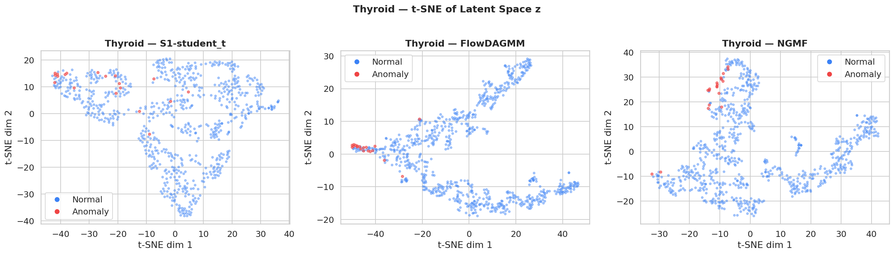
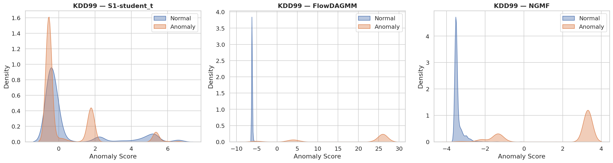
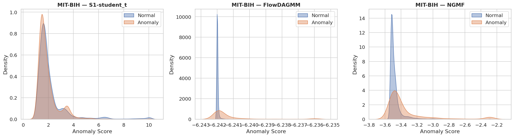
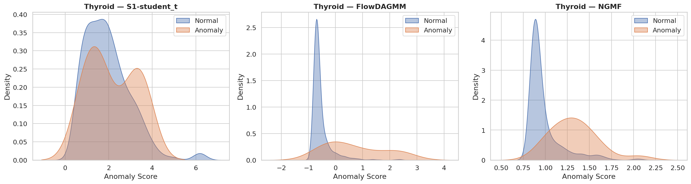

# GMM-Based Anomaly Detection: Learning Beyond Gaussian Assumptions

[](https://iitgn.ac.in/)
[](#group---fortytwo)
[](#datasets)

This project extends the **Deep Autoencoding Gaussian Mixture Model (DAGMM)** for unsupervised anomaly detection by relaxing its Gaussian distributional assumptions. We explore three progressively expressive density-estimation strategies to address limitations arising from heavy tails, skewness, and multimodal structures in real-world anomaly detection tasks.

---

## Authors (Group - FortyTwo)
* **Suhani**
* **Mayank Choudhary**
* **Mateen Sharief**
* **Lingala Hasini** 

*IIT Gandhinagar, Gandhinagar, Gujarat, India*  
*Course Instructor: Prof. Anirban Dasgupta*

---

## Project Overview

The standard DAGMM framework maps input features into a low-dimensional space using an autoencoder and performs joint density estimation on the latent representation using a Gaussian Mixture Model (GMM). However, Gaussian assumptions are often violated by complex real-world data.

This project implements and evaluates three proposed strategies:
1. **Strategy 1 (Non-Gaussian Components):** Replacing Gaussian mixture components with **Student-$t$**, **Laplace**, or **Skew-Normal** distributions.
2. **Strategy 2 (FlowDAGMM):** Replacing the GMM entirely with a **RealNVP Normalizing Flow** density estimator.
3. **Strategy 3 (Non-Gaussian Mixture Flow - NGMF):** Equipping each mixture component with its own lightweight **RealNVP flow over a Student-$t$ base**, combining mixture interpretability with normalizing flow flexibility.

Additionally, we integrate a **Dirichlet-Process-inspired estimation network** with temperature annealing to automatically learn the effective number of mixture components.

---

## Model Architecture

The architecture consists of:
- **Shared Deep Autoencoder:** 
  - **Encoder:** $\mathbb{R}^d \to 60 \to 30 \to 10 \to d_z$ (with Tanh activations) to produce latent code $z_c$.
  - **Decoder:** Mirrors the encoder.
  - **Augmented Latent Space:** $z = [z_c \mid \text{rel-Euclidean error} \mid \text{cosine similarity}] \in \mathbb{R}^{d_z + 2}$.
- **Density Estimation Head:**
  - **Baseline DAGMM:** GMM density head.
  - **ModifiedDAGMM (Strategy 1):** Student-$t$, Laplace, or Skew-Normal mixture estimation.
  - **FlowDAGMM (Strategy 2):** 6-layer RealNVP normalizing flow with alternating masks.
  - **NGMF (Strategy 3):** 4-layer RealNVP flows mapped over Student-$t$ base distributions for each component.

---

## Datasets

The models were evaluated using an 80/20 semi-supervised split (training only on the normal/majority class) on:
1. **KDD Cup 99:** Network intrusion detection dataset (494,021 samples, 41 features one-hot encoded to 118).
2. **MIT-BIH Arrhythmia:** ECG heartbeat amplitudes (Normal class: 'N'; all other beats are anomalies).
3. **Thyroid:** UCI medical benchmark (3,772 samples, 6 features).

---

## Experimental Results

The table below summarizes performance (AUROC, Best-Threshold F1, Precision, and Recall) across the three benchmarks.

| Dataset | Model Type | Model Name | AUROC | F1-Score | Precision | Recall |
| :--- | :--- | :--- | :---: | :---: | :---: | :---: |
| **KDD Cup 99** | **Baselines** | Deep SVDD | **0.9993** | **0.9950** | 0.9989 | 0.9912 |
| | | Isolation Forest | 0.9870 | 0.9910 | 0.9949 | 0.9872 |
| | | One-Class SVM | 0.9548 | 0.9892 | 0.9839 | 0.9944 |
| | | VAE | 0.8103 | 0.9694 | 0.9475 | 0.9924 |
| | **Proposed** | Baseline DAGMM | 0.0925 | 0.8848 | 0.8020 | 0.9867 |
| | | Strategy 1: Student-$t$ Mixture | 0.3704 | 0.3254 | 0.8171 | 0.2031 |
| | | Strategy 1: Laplace Mixture | 0.8072 | 0.3223 | 0.8090 | 0.2012 |
| | | Strategy 1: Skew-Normal Mixture | 0.9249 | 0.0601 | 0.6704 | 0.0315 |
| | | **Strategy 2: FlowDAGMM (Ours)** | **0.9983** | **0.9928** | 0.9936 | **0.9921** |
| | | Strategy 3: NGMF | 0.9945 | 0.9890 | **0.9959** | 0.9821 |
| **MIT-BIH** | **Baselines** | **Deep SVDD** | **0.8442** | 0.6180 | 0.6541 | 0.5856 |
| | | One-Class SVM | 0.8121 | **0.6456** | **0.7259** | 0.5813 |
| | | VAE | 0.8019 | 0.5756 | 0.6948 | 0.4912 |
| | | Isolation Forest | 0.7702 | 0.4608 | 0.4878 | 0.4367 |
| | **Proposed** | Baseline DAGMM | 0.5133 | 0.1893 | 0.1047 | **0.9896** |
| | | Strategy 1: Student-$t$ Mixture | 0.4496 | 0.1222 | 0.0931 | 0.1778 |
| | | Strategy 1: Laplace Mixture | 0.6411 | 0.2434 | 0.1855 | 0.3542 |
| | | Strategy 1: Skew-Normal Mixture | 0.4197 | 0.1385 | 0.1055 | 0.2015 |
| | | **Strategy 2: FlowDAGMM (Ours)** | **0.8169** | **0.5461** | **0.5377** | 0.5548 |
| | | Strategy 3: NGMF | 0.7033 | 0.3333 | 0.2708 | 0.4334 |
| **Thyroid** | **Baselines** | **Isolation Forest** | **0.9936** | **0.7895** | **0.7895** | **0.7895** |
| | | One-Class SVM | 0.9808 | 0.5714 | 0.5217 | 0.6316 |
| | | VAE | 0.9552 | 0.4783 | 0.4074 | 0.5789 |
| | | Deep SVDD | 0.9331 | 0.3529 | 0.2449 | 0.6316 |
| | **Proposed** | Baseline DAGMM | 0.5537 | 0.0959 | 0.0551 | 0.3684 |
| | | Strategy 1: Student-$t$ Mixture | 0.5616 | 0.1136 | 0.0725 | 0.2632 |
| | | Strategy 1: Laplace Mixture | 0.7753 | 0.2105 | 0.1579 | 0.3158 |
| | | Strategy 1: Skew-Normal Mixture | 0.8340 | 0.2623 | 0.1905 | 0.4211 |
| | | **Strategy 2: FlowDAGMM (Ours)** | **0.9328** | **0.4286** | **0.3913** | 0.4737 |
| | | Strategy 3: NGMF | 0.8951 | 0.2444 | 0.1549 | **0.5789** |

---

## Visualizations

### Performance Comparison
| All Models Performance Comparison | Strategy-wise Performance Comparison |
| :---: | :---: |
|  |  |

### Latent Space Separation (t-SNE)
| KDD Cup 99 | MIT-BIH Arrhythmia | Thyroid |
| :---: | :---: | :---: |
|  |  |  |

### Anomaly Score Density Estimates
| KDD Cup 99 KDE | MIT-BIH Arrhythmia KDE | Thyroid KDE |
| :---: | :---: | :---: |
|  |  |  |

---

## Key Findings

1. **FlowDAGMM is the best proposed method:** FlowDAGMM achieves competitive results with state-of-the-art baselines like Deep SVDD, significantly outperforming baseline DAGMM and Strategy 1 variants.
2. **Optimization over Distributional Complexity:** Replacing Gaussian components with heavier-tailed distributions (Strategy 1) underperforms due to severe optimization difficulties when updating parameters per-batch.
3. **Hybrid Complexity (NGMF):** The NGMF hybrid (Strategy 3) does not yield benefits over the simpler FlowDAGMM, indicating that local per-component flows in lower-dimensional spaces add parameter noise without capturing more anomaly structure.
4. **DAGMM Instability:** Standard DAGMM suffers from extreme optimization instability, failing catastrophically on KDD99 (AUROC 0.093). Removing the covariance matrix parameters in FlowDAGMM stabilizes the joint training.

---

## How to Run

1. Place the datasets inside the `datasets/` directory:
   - `MIT-BIH_Arrhythmia_Database.csv`
   - `thyroid.mat`
2. Open the main interactive notebook:
   ```bash
   jupyter notebook IDS_Project_Final.ipynb
   ```
3. Run all cells in sequence to train the models, generate performance metrics, and reproduce visualizations.

---

## Acknowledgments
We express our gratitude to **Prof. Anirban Dasgupta** for guidance and support during the CS328 (Introduction to Data Science) course at IIT Gandhinagar.
